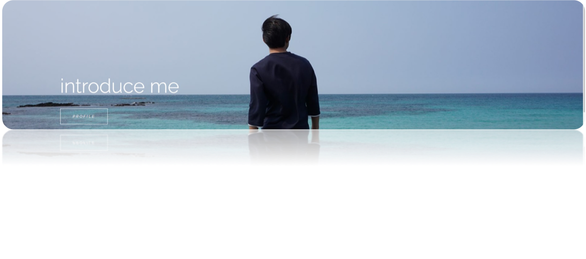

# Park Chunjoo :sunglasses:

```
안녕하세요, 끊임없이 성장하는 개발자를 지향 합니다. 박천주 입니다.
이 페이지는 저의 개발성향과 지금까지의 개발이력을 소개하고 있습니다.
```

## Profile

<table with="100%" style="border: 0;">
    <tr>
        <td width="50%"> 이름: 박천주 </td>
        <td width="50%"> 생년월일: 1989.01.31 </td>
    </tr>
    <tr>
        <td width="50%"> 연락처: 010-9165-9152 </td>
        <td width="50%"> 이메일: zeus@kakao.com </td>
    </tr>
    <tr>
        <td width="50%"> 사는곳: 경기도 군포시 </td>
        <td width="50%"> 홈페이지: https://zewtion.github.io/intro </td>
    </tr>
    <tr>
        <td width="50%"> 깃헙: https://github.com/zewtion </td>
        <td width="50%"> 카톡: https://open.kakao.com/me/vcjoo </td>
    </tr>
</table>

## License

- 정보처리기사( 2016.07 )
- 마이데이터관리자( 2021.09 )
- OA마스터 1급( 2012.12 )
- 운전면허증 1종보통( 2011.09 )
- 소방안전관리자 2급( 2017.06 )

## small talk

간단한 잡담을 적어놓았습니다  
제가 어떤 사람인지 주관적으로 볼 수 있도록이요!  

**제 MBTI는 ISFJ입니다** 성향분석을 믿지는 않지만  
저의 성향을 객관적으로 표현하는데 좋은 참고지표가 될 것 같습니다

저는 내향적인 성격으로 차분한 성격을 갖고 있습니다  
공허한 미래 보다는 눈 앞의 현실을 더 중요하게 생각 합니다  
상대방의 입장을 먼저 생각하는 공감능력을 갖고 있습니다  
조금은 계획적인 부분이 있어 해야 할 일을 미리 생각해두는 성격 입니다  

**개발하는 일을 즐거워 합니다**  
개발자의 시작은 고등학교 1학년 시절 싸이월드 였습니다  
싸이월드를 사용하던 중 만들어보면 어떨까 하는 생각이 들었습니다  
그렇게 개인 홈페이지를 만들어보게 되었고, 프로그래밍 언어에 대한 매력에 빠지게 되었습니다  
그 후로 웹개발이 취미가 되었고, 관력학과를 진학하여 2013년 개발자 경력을 시작했습니다  

**활동적인 취미를 좋아합니다**  
서핑보드, 스노우보드, 볼링, 자전거, 카메라, 등산 같은 취미 활동을 합니다  
개발자로 일하다 보면 느껴지는 따분함을 리프레시 해주는 활력소가 되어 줍니다  

## favorite tag
`#jsp` `#vue.js` `#spring` `#oracle` `#postgresql` `#scss` `#element-ui`
`#bootstrap` `#angular` `#ionic-framework` `볼링` `맥북` `갤럭시` `아스날` `네이비`
